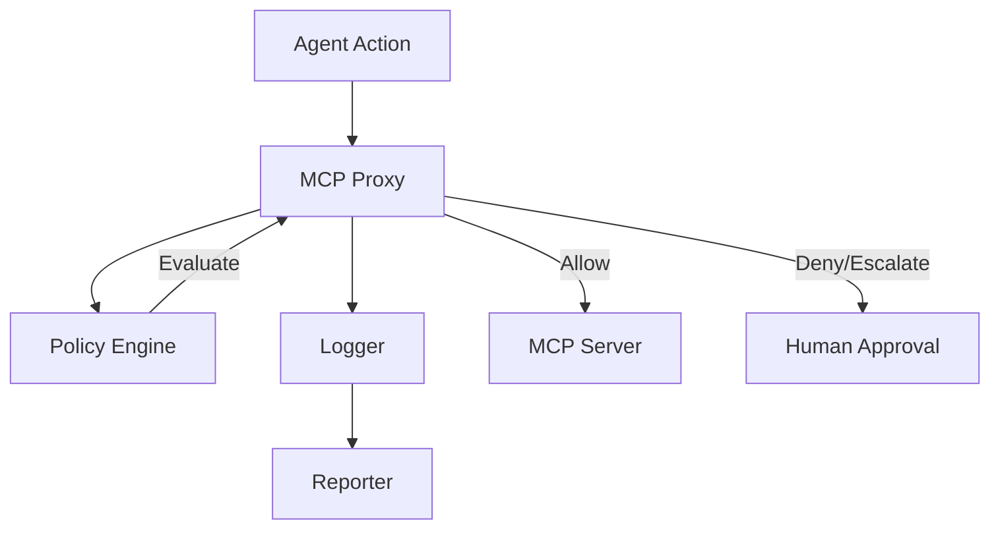

# agent-governance

<div align="center">
  
  
  
</div>


> Autonome Agenten brauchen Regeln. Nicht als Afterthought — als Fundament.

Was ISO 27001 für IT-Security ist, wird **agent-governance** für Agent-Operationen: das Framework das Unternehmen brauchen, bevor sie den ersten Agenten produktiv einsetzen. 

## Warum Agent Governance?

Mit dem **EU AI Act (2024/1689)**, insbesondere Artikel 50 (Transparenzpflichten), sowie der kommenden AI Liability Directive, verschiebt sich die Haftung. Wenn ein autonomer Agent ohne nachvollziehbare Leitplanken (Guardrails) agiert, gilt die *Vermutung der Fehlerhaftigkeit*. FinTech-Regulatoren fordern im Rahmen von *Know Your Agent (KYA)* eine menschliche Bindung für Agent Wallets.

Bislang fehlte ein Open-Source Framework, das Audit Logging, Policy Engine, Compliance Reporting und Human-Escalation vereint. `agent-governance` schließt diese Lücke und macht Governance zur First-Class Infrastructure.

## Architektur

`agent-governance` besteht aus vier Hauptkomponenten:



1. **Logger**: Unveränderliches Decision Trail Logging für jede Agent-Aktion.
2. **Policy Engine**: YAML-basierte Engine zur Evaluation von Aktionen (Allow, Deny, Require Approval).
3. **MCP Proxy**: Transparenter Proxy, der Policies auf MCP Tool Calls und Ressourcen anwendet.
4. **Reporter**: Generiert compliance-gerechte Berichte für Wirtschaftsprüfer.

## Beispiele

### Policy Engine (YAML)

Policies werden in deklarativem YAML definiert und dynamisch geladen:

```yaml
policies:
  - id: financial-limit
    name: "Finanzielles Limit"
    description: "Genehmigung erforderlich für Transaktionen über 1000€"
    conditions:
      - field: "$.action"
        operator: "eq"
        value: "payment:initiate"
      - field: "$.input.amount"
        operator: "gt"
        value: 1000
    action: require_approval
    priority: 100
```

### TypeScript Usage

```typescript
import { PolicyEngine } from '@agent-governance/policy-engine';
import { AgentAction } from '@agent-governance/core';

const engine = new PolicyEngine('./policies');
const action: AgentAction = {
  // ...
  action: 'payment:initiate',
  input: { amount: 1500 }
};

const decision = engine.evaluate(action);
if (decision === 'require_approval') {
  // Escalate to human
}
```

## Unterstützte Compliance Frameworks
- EU AI Act (Transparenz, Human Oversight)
- DSGVO (Datenminimierung, Consent Tracking)
- Financial Controls (Ausgabenlimits)
- Procurement (Vendor Restrictions)

---

**Teil des Agentic Commerce Stack von Matteo Ise:**

- [well-known-mcp](https://github.com/matteo-ise/well-known-mcp) — Discovery-Standard für KI-Agenten
- [agent-wallet-sdk](https://github.com/matteo-ise/agent-wallet-sdk) — Unified Payment Infrastructure für Agenten
- [agent-governance](https://github.com/matteo-ise/agent-governance) — Audit, Compliance & Human-Escalation
- [mcp-deutschland](https://github.com/matteo-ise/mcp-deutschland) — MCP-Server für ELSTER, DATEV, XRechnung
- [mcp-handelsregister](https://github.com/matteo-ise/mcp-handelsregister) — Deutsches Handelsregister für Agenten
- [agentic-commerce-sdk](https://github.com/matteo-ise/agentic-commerce-sdk) — Agent-to-Agent Commerce
- [agentic-maturity-model](https://github.com/matteo-ise/agentic-maturity-model) — Reifegrad-Framework (Stufe 0→5)
- [kontorstack](https://github.com/matteo-ise/kontorstack) — Full-Stack Framework für agentische Unternehmen

[Matteo Ise auf GitHub](https://github.com/matteo-ise) · [X/Twitter](https://x.com/matteoise)
